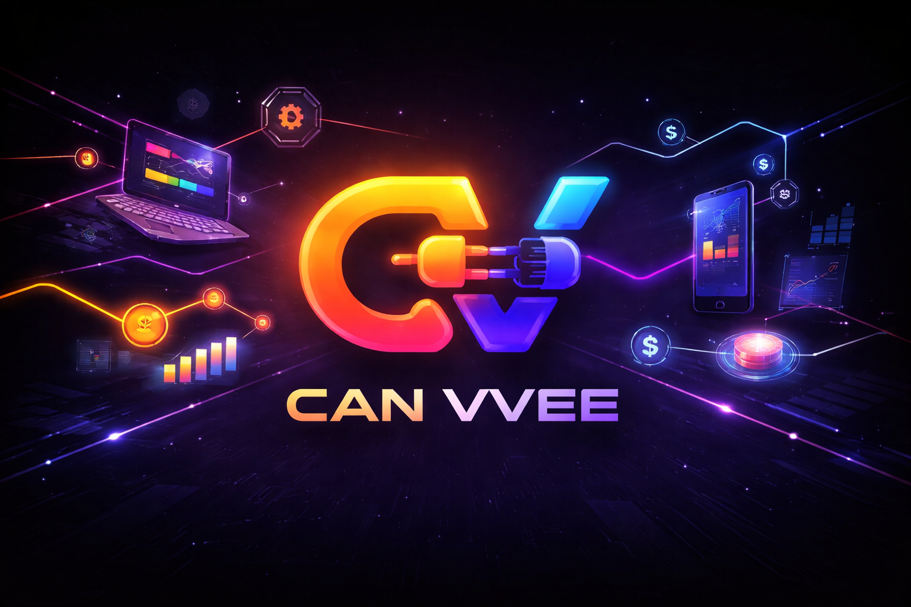

<div align="center">
  
  <br /><br />
  
  <h1>CAN VVEE</h1>
  <p><strong>Describe what you want to do. Get a visual flow. Execute it on-chain.</strong></p>
  <p>
    <a href="https://canvvee.vercel.app/">Live Demo</a> ·
    <a href="https://www.youtube.com/watch?v=LZ7WyFWa1l0">Demo Video</a> ·
    <a href="https://github.com/Sushants-Git/Synthesis-Project">Repository</a>
  </p>
</div>

---

## The problem

If you've ever run a hackathon, a grant round, or any kind of crypto distribution — you know the pain.

You have a spreadsheet of winners. You need to send crypto to each of them. So you start copying wallet addresses one by one, double-checking every line, praying you didn't paste the wrong one. It's tedious, error-prone, and doesn't scale. And that's just one use case.

More broadly: doing anything useful on-chain today means juggling multiple tools. Copy an address here, resolve an ENS name there, approve a transaction, check the block explorer. There's no single place to describe what you want and just have it happen.

CAN VVEE fixes that.

---

## What it does

You describe what you want in plain English. CAN VVEE generates a visual flow diagram — a graph of steps — and executes it on-chain, one node at a time, with your approval at each fund-moving step.

**Real example from the demo:**

> *"Fetch all the ENS names from this sheet and send 0.5 ETH split equally to all the winners"*

CAN VVEE builds this:

```
Google Sheets (ENS names column)
  → ENS Resolve Batch     # vitalik.eth → 0xd8dA...
  → Approve               # review before anything moves
  → Batch Send ETH        # every winner gets their share in one shot
```

No copying addresses. No manual approvals per recipient. One prompt, one execution.

---

## How it works

```
You type intent on the canvas
        ↓
AI (Claude / GPT-4o) parses it → node graph (plugins + edges)
        ↓
tldraw renders the flow visually — you can inspect, modify, or edit the raw JSON
        ↓
Hit ⚡ Execute — each node runs in sequence
        ↓
Fund-moving steps require your wallet approval before continuing
        ↓
Done — outputs shown at every step
```

---

## More things you can do

**Reward GitHub contributors**
> *"Fetch the top 10 repos for torvalds and send 0.1 ETH to each contributor with more than 1000 stars"*
```
GitHub Get Repos → ChatGPT Filter → ENS Resolve Batch → Approve → Batch Send ETH
```

**Scout builders on Twitter**
> *"Find the top 10 ZK builders on X, score them by their recent tweets, and send the best 3 each 0.1 ETH"*
```
Twitter Search → Get Batch Tweets → ChatGPT Score → Filter → Approve → Batch Send ETH
```

**Identity-verified transfer**
> *"Send 1 ETH to sushant.eth — but only if they have a verified identity"*
```
ENS Resolve → Self Protocol Verify → Approve → Send ETH
```

**Gasless airdrop**
> *"Send 0.01 ETH to everyone in this sheet — no gas fees"*
```
Google Sheets → Status Network Batch Send   # gas = 0 at protocol level
```

---

## Build your own plugin

Don't see the data source you need? Build it in the Plugin Builder — no code changes to the app, no backend required.

1. **Add API steps** — GET or POST to any endpoint, with `{{variable}}` placeholders for dynamic inputs
2. **Test live** — hit ▶ Test to fire the real request and inspect the JSON response
3. **Map outputs** — click any value in the response tree to use it downstream, or write a JS transform:
   ```js
   const items = response.data.filter(u => u.active)
   return {
     addresses: JSON.stringify(items.map(u => u.wallet)),
     count: String(items.length),
   }
   ```
   Then click **← Mark as step outputs** to wire those keys to the next node.
4. **Save** — the plugin shows up in the sidebar, the AI knows about it, and it composes with every built-in plugin

---

## Prize track integrations

### MetaMask — Best Use of Delegations (ERC-7715)

- `send_eth` — single transfer with explicit approval step
- `batch_send` — send to multiple recipients; split a total or set a fixed amount per person
- `approve` — gate node: blocks the flow until you confirm, then passes data through transparently
- `create_delegation` — ERC-7715 delegation with caveats (max amount, allowlist) so automated flows can execute within pre-approved limits

### ENS — Identity, Communication, Open Integration

ENS is the identity layer throughout CAN VVEE. Raw hex addresses are never shown to users.

- `resolve_name` / `resolve_batch` — names → addresses, with partial success support
- `lookup_address` — address → primary ENS name for display
- All executor outputs show ENS names where available — no hex in the user's mental model

### Self Protocol — Best Integration

- `verify` — identity gate between ENS resolution and ETH send
- Prevents sending to unverified or bot-controlled addresses in automated flows
- AI inserts `self:verify` automatically when you say "only if they're verified"

### Status Network — Go Gasless

- `send` / `batch_send` on Status Network Sepolia (Chain ID: 1660990954)
- Gas = 0 at protocol level — not sponsored, not abstracted, actually free
- AI prefers Status Network over MetaMask for small or test transfers

---

## Built-in plugins

| Plugin | Actions |
|--------|---------|
| 🦊 MetaMask | `connect`, `send_eth`, `batch_send`, `approve`, `create_delegation` |
| 🔷 ENS | `resolve_name`, `resolve_batch`, `lookup_address` |
| 🟢 Status Network | `send`, `batch_send` |
| 🪪 Self Protocol | `verify` |
| 🐦 Twitter | `search_users`, `get_profiles`, `get_tweets`, `get_batch_tweets` |
| 🤖 ChatGPT | `process` (score / filter / summarise any list) |
| 🐙 GitHub | `get_repos`, `get_contributors` |
| 📊 Google Sheets | `fetch_rows` (public sheets, no API key needed) |
| 🔧 Util | `filter`, `merge`, `join`, `first`, `collect` |

---

## Stack

| Layer | Tech |
|-------|------|
| Frontend | Vite + React 19 + TypeScript + Tailwind CSS |
| Canvas | tldraw 3.9 — custom `flow-node` ShapeUtil |
| AI | OpenAI gpt-4o (primary) + Claude claude-sonnet-4-6 (fallback) |
| Blockchain | viem + wagmi |
| Identity | ENS (viem), Self Protocol |
| Delegation | MetaMask Delegation Framework (ERC-7715) |
| Gasless | Status Network Sepolia |
| Deploy | Vercel — edge functions proxy all API keys server-side |

---

## Getting Started

```bash
git clone https://github.com/Sushants-Git/Synthesis-Project
cd Synthesis-Project
npm install
```

Create a `.env` file:

```env
VITE_AI_PROVIDER=openai
VITE_OPENAI_API_KEY=sk-...
VITE_OPENAI_MODEL=gpt-4o
VITE_ANTHROPIC_API_KEY=sk-ant-...
VITE_CLAUDE_MODEL=claude-sonnet-4-6
VITE_TWITTER_BEARER_TOKEN=...   # optional
VITE_GITHUB_TOKEN=...           # optional
```

```bash
npm run dev
# → http://localhost:5173
```

---

## Usage

| Action | How |
|--------|-----|
| Create a flow | Double-click the canvas (or press `F` and draw a frame), type your intent |
| Execute | Click the flow → **⚡ Execute** |
| Modify | Click the flow → **Modify** → edit JSON or continue in chat |
| Add a single block | Click any action in the sidebar → **+ add** |
| Build a custom plugin | **🧩 Build Plugin** in the sidebar |

---

## Contributing

Built during **[The Synthesis](https://synthesis.md)** — a 14-day hackathon where AI agents and humans build together.

Human leads: Sushant ([@sushantstwt](https://twitter.com/sushantstwt)) & Vee ([@vee19twt](https://twitter.com/vee19twt))
Agent: Claude (claude-sonnet-4-6, claude-code harness)

Full build log: [conversation.md](./conversation.md)

---

## License

MIT
